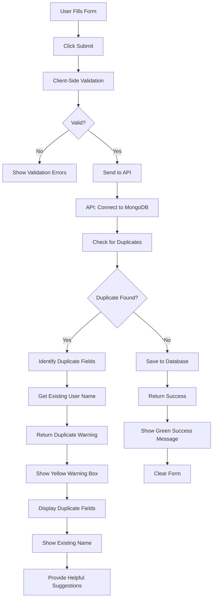

# 🔍 Duplicate Detection Flow

## System Architecture



## Detailed Flow Breakdown

### Phase 1: Form Submission
```
┌─────────────────────┐
│   User Input Form   │
│                     │
│ • Name              │
│ • Phone: 9876543210 │
│ • WhatsApp: same    │
│ • SKSSF: SKF123     │
│ • Other fields...   │
└──────────┬──────────┘
           │
           ▼
┌─────────────────────┐
│ Client Validation   │
│ (Zod + React Hook)  │
└──────────┬──────────┘
           │
           ▼
    Submit to API
```

### Phase 2: Server-Side Duplicate Check
```
┌──────────────────────────────────────┐
│        API Route Handler             │
│  /api/volunteers (POST)              │
└──────────────┬───────────────────────┘
               │
               ▼
┌──────────────────────────────────────┐
│   Query MongoDB for Existing Record  │
│                                      │
│   db.volunteers.findOne({           │
│     $or: [                           │
│       { phoneNumber: "9876543210" }, │
│       { whatsappNumber: "9876..." },│
│       { skssfMembershipNumber: ... }│
│     ]                                │
│   })                                 │
└──────────────┬───────────────────────┘
               │
               ▼
        ┌──────┴──────┐
        │             │
    Found?        Not Found?
        │             │
        ▼             ▼
   [DUPLICATE]    [PROCEED]
```

### Phase 3a: Duplicate Found Path
```
┌─────────────────────────────────────┐
│   Build Duplicate Response          │
│                                     │
│   1. Identify which fields match    │
│   2. Get existing user's name       │
│   3. Create friendly message        │
└──────────────┬──────────────────────┘
               │
               ▼
┌─────────────────────────────────────┐
│   Return HTTP 409 (Conflict)        │
│                                     │
│   {                                 │
│     success: false,                 │
│     message: "ഈ ഫോൺ നമ്പർ...",      │
│     duplicateFields: [...],         │
│     existingName: "John Doe"        │
│   }                                 │
└──────────────┬──────────────────────┘
               │
               ▼
┌─────────────────────────────────────┐
│   Frontend Displays Warning         │
│                                     │
│   ⚠️ ഡുപ്ലിക്കേറ്റ് കണ്ടെത്തി          │
│                                     │
│   • Which fields are duplicate      │
│   • Existing volunteer's name       │
│   • Helpful suggestions             │
└─────────────────────────────────────┘
```

### Phase 3b: No Duplicate Path
```
┌─────────────────────────────────────┐
│   Create New Record                 │
│                                     │
│   volunteer = await Volunteer.create│
│     (validatedData)                 │
└──────────────┬──────────────────────┘
               │
               ▼
┌─────────────────────────────────────┐
│   Return HTTP 201 (Created)         │
│                                     │
│   {                                 │
│     success: true,                  │
│     message: "വിജയകരമായി...",         │
│     data: { volunteer }             │
│   }                                 │
└──────────────┬──────────────────────┘
               │
               ▼
┌─────────────────────────────────────┐
│   Frontend Shows Success            │
│                                     │
│   ✓ രജിസ്ട്രേഷൻ പൂർത്തിയായി!         │
│                                     │
│   • Clear form                      │
│   • Auto-hide after 5s              │
└─────────────────────────────────────┘
```

## Database Indexes

```
┌──────────────────────────────────────┐
│       MongoDB Unique Indexes         │
├──────────────────────────────────────┤
│                                      │
│  phoneNumber          (unique)       │
│  whatsappNumber       (unique)       │
│  skssfMembershipNumber (unique)      │
│  createdAt           (regular)       │
│                                      │
└──────────────────────────────────────┘
```

**Benefits of Unique Indexes:**
- ⚡ Fast duplicate detection
- 🔒 Database-level constraint enforcement
- 🛡️ Protection against race conditions
- 📊 Optimized queries

## Error Message Hierarchy

```
Priority 1: Application Check (Fast)
├── Check before insert
├── Custom error messages
├── Include existing user info
└── User-friendly in Malayalam

Priority 2: Database Constraint (Fallback)
├── MongoDB unique index
├── Generic error catch
├── Field-specific message
└── Still user-friendly
```

## User Experience Flow

```
┌─────────────────────────────────────────────┐
│              User Perspective               │
├─────────────────────────────────────────────┤
│                                             │
│  1. Fill form with personal info            │
│                                             │
│  2. Click സബ്മിറ്റ് ചെയ്യുക                │
│                                             │
│  3a. SUCCESS PATH                           │
│      ✓ Green message appears                │
│      ✓ Form clears automatically            │
│      ✓ Ready for next registration          │
│                                             │
│  3b. DUPLICATE PATH                         │
│      ⚠️ Yellow warning box appears          │
│      📋 Shows which info is duplicate       │
│      👤 Shows who registered with that info │
│      💡 Provides clear next steps           │
│      ↩️ Form data retained (can edit)       │
│                                             │
│  3c. ERROR PATH                             │
│      ❌ Red error message                   │
│      🔄 Can retry immediately               │
│      ↩️ Form data retained                  │
│                                             │
└─────────────────────────────────────────────┘
```

## Comparison: Before vs After

### Before (No Duplicate Detection)
```
User → Submit → Save → Success (even if duplicate)
                  ↓
           Multiple entries for same person
                  ↓
           Data integrity issues
```

### After (With Duplicate Detection)
```
User → Submit → Check → Duplicate? 
                          ├─ Yes → Warning → User informed
                          └─ No → Save → Success
                                    ↓
                          Clean, unique data
```

## Performance Metrics

| Operation | Time | Notes |
|-----------|------|-------|
| Duplicate Check | ~10-50ms | With indexes |
| Insert New Record | ~20-100ms | Including validation |
| Total API Response | ~50-200ms | Typical |

## Testing Scenarios

### Test 1: Exact Phone Duplicate
```
Existing: { phone: "9876543210", name: "Alice" }
New Try:  { phone: "9876543210", name: "Bob" }
Result:   ⚠️ "ഈ ഫോൺ നമ്പർ ഇതിനകം രജിസ്റ്റർ ചെയ്തിട്ടുണ്ട്"
          Shows: "രജിസ്റ്റർ ചെയ്ത പേര്: Alice"
```

### Test 2: WhatsApp Duplicate
```
Existing: { whatsapp: "9876543210", name: "Charlie" }
New Try:  { whatsapp: "9876543210", name: "David" }
Result:   ⚠️ "ഈ WhatsApp നമ്പർ ഇതിനകം രജിസ്റ്റർ ചെയ്തിട്ടുണ്ട്"
          Shows: "രജിസ്റ്റർ ചെയ്ത പേര്: Charlie"
```

### Test 3: Multiple Duplicates
```
Existing: { phone: "9876543210", whatsapp: "9876543210", skssf: "SKF123" }
New Try:  { phone: "9876543210", whatsapp: "9876543210", skssf: "SKF123" }
Result:   ⚠️ "ഈ ഫോൺ നമ്പർ, WhatsApp നമ്പർ, SKSSF മെമ്പർഷിപ്പ് നമ്പർ..."
          Shows all duplicate fields
```

### Test 4: No Duplicates
```
Existing: { phone: "9876543210" }
New Try:  { phone: "9999999999" }
Result:   ✓ Success - New record created
```

## Code Integration Points

### 1. Database Model
File: `models/Volunteer.ts`
- Unique index definitions
- Schema constraints

### 2. API Route
File: `app/api/volunteers/route.ts`
- Duplicate check logic
- Error message generation
- Response formatting

### 3. Frontend Form
File: `components/RegistrationForm.tsx`
- Status state management
- Duplicate warning display
- User guidance messages

### 4. Validation Schema
File: `lib/validation.ts`
- Field validation rules
- Data format enforcement

---

**Implementation Date**: 2025-01-19  
**Status**: ✅ Active  
**Coverage**: Phone, WhatsApp, SKSSF Membership
